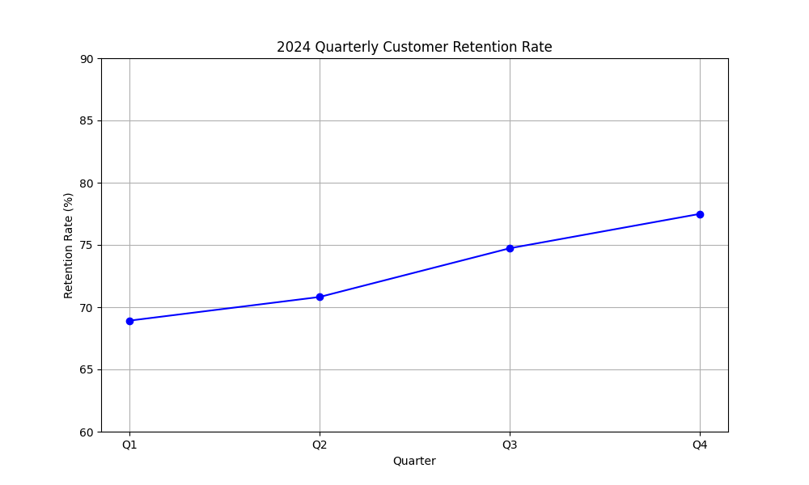
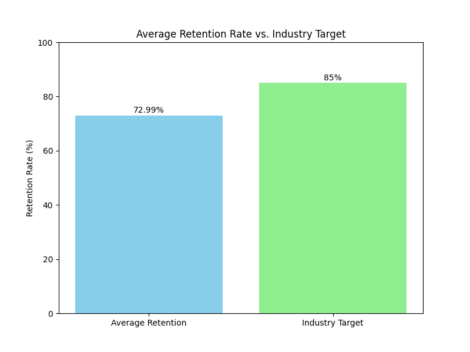

# 2024 Customer Retention Analysis

This report provides an analysis of the customer retention rates for the year 2024, comparing them against the industry benchmark and offering recommendations for improvement.

## Data Overview

The quarterly customer retention data for 2024 is as follows:
- **Q1:** 68.92%
- **Q2:** 70.82%
- **Q3:** 74.73%
- **Q4:** 77.49%

The **average retention rate** for the year is **72.99%**. The industry target is **85%**.

## Visualizations

### Quarterly Retention Trend

### Average Retention vs. Industry Target

## Key Findings

- **Positive Growth:** There is a consistent and positive upward trend in customer retention throughout the four quarters of 2024.
- **Performance Gap:** Despite the positive trend, the average retention rate of 72.99% is significantly below the industry target of 85%.

## Business Implications

The current trend indicates that while efforts to retain customers are improving, they are not yet competitive enough. This gap can lead to a loss of market share and increased customer acquisition costs to replace churned customers. Closing this gap is crucial for long-term sustainable growth.

## Recommendations

To achieve the industry target of 85%, a more proactive and strategic approach is necessary. The key recommendation is to **implement targeted retention campaigns**. This could involve:

- **Customer Segmentation:** Identifying and segmenting customers based on their behavior, value, and churn risk.
- **Personalized Communication:** Tailoring offers and communication to meet the specific needs of each customer segment.
- **Loyalty Programs:** Rewarding long-term customers to foster loyalty and advocacy.

---

*Contact for verification: 24f2002242@ds.study.iitm.ac.in*
